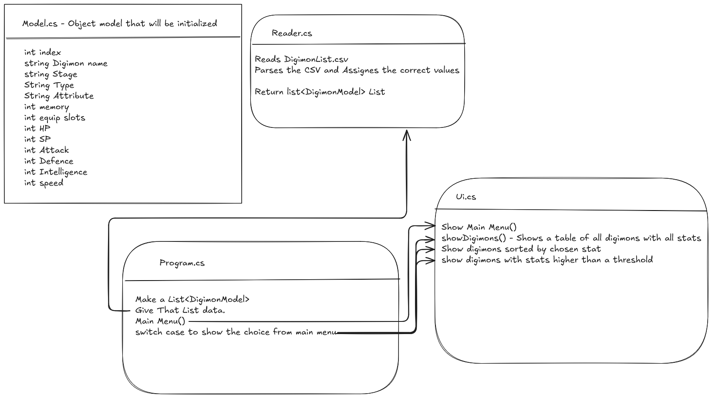

# Digimon Dataset Explorer Using Linq

### a simple program that parses a csv file using linq and allows the user to show all digimons, show digimons sorted by a certain stat, and show digimons with a certain stat higher than a threshold. The program uses Spectre.Console for a nice user interface.